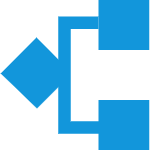

<div align="center">

</div>
<p></p>
<div align="center">

[](https://travis-ci.com/wangxiao95/sequence)
[](https://coveralls.io/github/wangxiao95/sequence?branch=master)

</div>


> 解决依赖性并发【sequence】

## install

yarn add sequence -S

## example

```js
import S from 'sequence'
import _ from 'lodash'

const mockList = [
  { oldId: 1 }, { oldId: 2 }
]

const mockNewPropertyList = [
  { newId: 11 }, { newId: 22 }
]

const promiseList = function () {
  return new Promise((resolve) => {
    _.delay(() => {
      resolve(mockList)
    }, 1000)
  })
}

const promiseNewPropertyList = function () {
  return new Promise((resolve) => {
    _.delay(() => {
      resolve(mockNewPropertyList)
    }, 1000)
  })
}

const promiseCount = function () {
  return new Promise((resolve) => {
    _.delay(() => {
      resolve(mockList.length)
    }, 1000)
  })
}

const getList = function (context) {
  return promiseList().then(list => {
    context.list = list
  })
}

const getNewPropertyList = function (context) {
  return promiseNewPropertyList().then(newPropertyList => {
    _.map(context.list, (item, i) => {
      item.newId = newPropertyList[i].newId
    })
  })
}

const getCount = function (context) {
  return promiseCount().then(count => {
    context.count = count
  })
}

// 支持如下配置方式
const sequenceConfig = [
  {
    promise: getList,
    thenRun: [
      getNewPropertyList,
    ],
  },
  getCount,
]

const expectResult = {
  list: [
    {
      oldId: 1,
      newId: 11,
    },
    {
      oldId: 2,
      newId: 22,
    }
  ],
  count: 2
}

async function init() {
  const result = await S.allSettled(config, {})
  console.log(result === expectResult) // true
}

init()

```